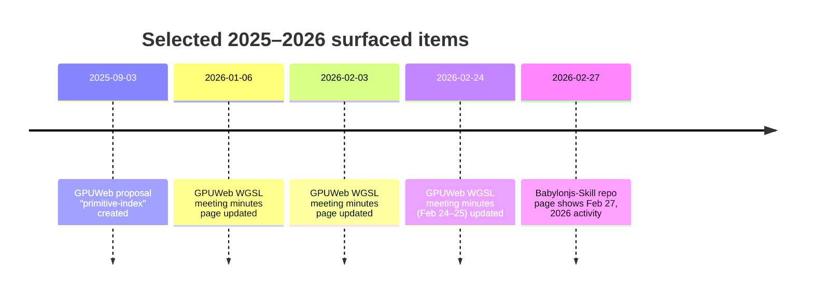

# Deep Research Report on Existing Markdown “Skill” Files for Babylon.js and WGSL

## Executive summary

Bro—your request maps to two distinct ecosystems of “structured guidance” Markdown:

First, the official Babylon.js documentation Markdown in the entity["organization","BabylonJS","github org"] docs repo includes several WebGPU/WGSL‑specific pages that are directly actionable for advanced shader work (especially the WGSL-in-ShaderMaterial guide). citeturn5search1turn0search3turn0search4turn5search0

Second, a newer “agent skills” ecosystem has emerged where repos ship `SKILL.md` + curated `references/*.md`. In that category, a Babylon‑specific skill bundle updated in 2026 was found, plus a WebGPU/WGSL‑focused skill bundle (`SKILL.md`, `REFERENCE.md`). citeturn16view0turn16view1

A smaller but highly relevant third category appears as project “workflow” docs (not always literally named `workflows.md`) that describe reproducible WGSL authoring conventions plus code generation into Babylon.js runtime helpers—this is exactly the kind of “system file” that helps research‑grade iteration. citeturn16view2

## Method and selection criteria

The search emphasized Markdown files that behave like “system guidance” documents: explicit rules, repeatable workflows, decision matrices, “how to write X safely” constraints, and anything resembling a skill entrypoint (`SKILL.md`) or a rules/workflow doc (`rules.md`, `workflows.md`, “architecture.md”, etc.). citeturn16view0turn16view2

Priority weighting followed your instruction: upstream/official sources first (Babylon engine documentation; the entity["organization","gpuweb","w3c gpu for the web"] spec repo under entity["organization","W3C","web standards body"]; and entity["organization","Mozilla","web browser maker"]’s MDN content repo), then major repos that are widely used as references or tooling. citeturn15search15turn13search4turn19view0

For each candidate, “scope” (beginner → research) was judged by: (a) whether the file addresses real GPU pipeline constraints (binding layouts, subgroup behavior, depth/early‑Z implications), (b) whether it includes nontrivial examples or prescriptive constraints, and (c) whether it is anchored to spec/engine internals rather than surface-level API usage. citeturn5search1turn13search24turn13search8turn16view2

When a file’s “latest commit date” was not present in the retrieved sources, it is explicitly marked “unspecified” (per your instruction). Where a date is embedded in the document itself (e.g., “Created: YYYY‑MM‑DD” in GPUWeb proposals) or where a GitHub page shows a 2026 update, that date is used. citeturn13search18turn13search3turn16view0

## Top candidate Markdown files for Babylon.js skills

### B1 — Writing shaders for WebGPU in WGSL
Repository/site: BabylonJS/Documentation  
Direct link: `https://github.com/BabylonJS/Documentation/blob/master/content/setup/support/webGPU/webGPUWGSL.md`  
Date: unspecified (latest commit/date not captured in retrieved sources) citeturn5search1  
Summary: This is the most directly useful Babylon-side document for advanced WGSL shader authoring. It explains how Babylon’s ShaderMaterial accepts WGSL, how to select WGSL as the shader language, how Babylon maps familiar GLSL-like declarations (`attribute/varying/uniform`) onto WGSL structures, and how bindings are auto-assigned. It also calls out WebGPU NDC z-range differences and shows usage of newer WGSL objects like storage textures/buffers and external textures. citeturn5search1  
Scope: advanced → research  
Key topics: ShaderMaterial WGSL mode, entry points, Babylon shader “include” system, UBO access patterns, binding auto-generation, storage resources, external textures, NDC differences citeturn5search1  
Why it’s relevant to advanced WGSL shader work: It documents the *Babylon-specific dialect/bridge* you must internalize to do serious WGSL inside Babylon: how variables are accessed (`vertexInputs/fragmentInputs`), how UBOs are surfaced, and what you must not do (manual `@group/@binding`), which are exactly the failure points in research-grade shader pipelines. citeturn5search1

### B2 — WebGPU breaking changes
Repository/site: BabylonJS/Documentation  
Direct link: `https://github.com/BabylonJS/Documentation/blob/master/content/setup/support/webGPU/webGPUBreakingChanges.md`  
Date: unspecified citeturn5search0  
Summary: A focused list of behavior deltas between WebGL and WebGPU in Babylon, including shader code constraints that tend to break real-world ports (sampler handling, texture array indexing limitations, stricter binding requirements). It also highlights asynchronous differences (e.g., texture reads), which matter when a pipeline mixes GPU compute + readback for analysis or validation. citeturn5search0  
Scope: advanced  
Key topics: WebGPU vs WebGL behavioral differences, shader portability constraints, binding strictness, async readPixels citeturn5search0  
Why it’s relevant: Research-grade shader work often starts by porting known GLSL/PBR/compute kernels. This page is essentially a “portability checklist” for Babylon/WebGPU that prevents time loss on non-obvious WebGPU validation failures. citeturn5search0

### B3 — WebGPU Internals
Repository/site: BabylonJS/Documentation  
Direct link: `https://github.com/BabylonJS/Documentation/blob/master/content/setup/support/webGPU/webGPUInternals.md`  
Date: unspecified citeturn0search4  
Summary: An internal-facing overview of Babylon’s WebGPU engine architecture and design constraints. It is most valuable when you’re pushing beyond surface ShaderMaterial usage into understanding how the engine constructs pipelines, manages shader processing, and handles resource binding. citeturn0search4  
Scope: advanced → research  
Key topics: Engine internals, shader processing pipeline, architecture/implementation notes citeturn0search4  
Why it’s relevant: If you’re validating novel shading/compute techniques (e.g., heavy bind group layouts, dynamic pipelines, introspection), you need to understand the engine’s internal assumptions; this doc is the gateway to that mental model. citeturn0search4

### B4 — Node Material (Node Material system and code generation)
Repository/site: BabylonJS/Documentation  
Direct link: `https://github.com/BabylonJS/Documentation/blob/master/content/features/featuresDeepDive/materials/node_material/nodeMaterial.md`  
Date: unspecified citeturn0search3  
Summary: Describes Babylon’s Node Material system and, crucially for WGSL work, documents how to generate shader code with `shaderLanguage: ShaderLanguage.WGSL`, including options like emitting descriptive comments. This is a practical bridge between graph-based prototyping and hand-edited WGSL. citeturn0search3  
Scope: intermediate → advanced  
Key topics: Node materials, shader generation, WGSL output options, tooling-assisted workflows citeturn0search3  
Why it’s relevant: For research-grade iteration, node-based “scaffolding” can generate correct bindings/boilerplate quickly, while you focus on novel math/kernels; generating WGSL (not GLSL) reduces toolchain friction in WebGPU-first pipelines. citeturn0search3

### B5 — Code splitting / async chunks (WebGL vs WebGPU shader separation)
Repository/site: BabylonJS/Documentation  
Direct link: `https://github.com/BabylonJS/Documentation/blob/master/content/setup/support/asyncChunks.md`  
Date: unspecified citeturn14search7  
Summary: Explains Babylon’s async-loading architecture and why WebGL and WebGPU shader code is split into separate chunks. This matters for shader-heavy applications because build outputs, runtime loading, and “startup compile tax” often dominate performance. citeturn14search7  
Scope: advanced (engineering)  
Key topics: Bundlers, code splitting, shader code chunking, deployment implications citeturn14search7  
Why it’s relevant: Research-grade shader development frequently involves many shader variants and experiments; understanding packaging and chunking helps avoid accidental “shader pipeline regression” where the experimental workload is dominated by startup/compilation overhead rather than GPU cost. citeturn14search7

### B6 — CDN / WebGPU dependencies setup (glslang + twgsl)
Repository/site: BabylonJS/Documentation  
Direct link: `https://github.com/BabylonJS/Documentation/blob/master/content/setup/frameworkPackages/CDN.md`  
Date: unspecified citeturn0search14  
Summary: Documents that Babylon’s WebGPU path requires `glslang` and `twgsl` (and their WASM binaries), and shows how to configure their URLs. This is operationally important when deploying shader pipelines that rely on GLSL-to-WGSL translation or legacy shader injection. citeturn0search14  
Scope: intermediate → advanced  
Key topics: WebGPU dependency loading, tooling binaries, configuration patterns citeturn0search14  
Why it’s relevant: Even if you prefer pure WGSL, real projects often need a translation fallback (legacy GLSL snippets, plugin code, etc.). Knowing how Babylon loads these tools is essential for deterministic, reproducible shader research environments. citeturn0search14

### B7 — Putting shader code into Babylon.js
Repository/site: BabylonJS/Documentation  
Direct link: `https://github.com/BabylonJS/Documentation/blob/master/content/features/featuresDeepDive/materials/shaders/shaderCodeInBjs.md`  
Date: unspecified citeturn3search5  
Summary: Provides a structured overview of multiple ways to inject shader code into a Babylon scene (e.g., ShaderMaterial workflows, script tags, external files, shader builder tooling). It’s a practical “entry map” for building a repeatable shader authoring pipeline. citeturn3search5  
Scope: intermediate  
Key topics: Shader code injection modalities, ShaderMaterial pipeline, tooling options citeturn3search5  
Why it’s relevant: Advanced WGSL work benefits from disciplined structure: where shaders live, how variants are built, and how data is passed. This doc helps you choose an approach compatible with long-lived research prototypes. citeturn3search5

### B8 — Gaussian Splatting (includes custom shader extension example via material plugins)
Repository/site: BabylonJS/Documentation  
Direct link: `https://github.com/BabylonJS/Documentation/blob/master/content/features/featuresDeepDive/mesh/gaussianSplatting.md`  
Date: unspecified citeturn7search2  
Summary: While primarily about Gaussian Splatting, this page includes an advanced section showing how to extend a material using `MaterialPluginBase`, including a concrete example that injects custom fragment code and prints compiled fragment source. It also describes GPU picking considerations and rendering implications for alpha-blended splats. citeturn7search2  
Scope: advanced → research  
Key topics: Material plugin hooks, shader customization injection points, introspection via compiled source, GPU picking workflows citeturn7search2  
Why it’s relevant: Research-grade shading often needs **instrumentation** (inspect generated shader code, inject probes, isolate passes). The plugin example shows a “supported” path to shader surgery inside Babylon’s pipeline. citeturn7search2

### B9 — Babylonjs-Skill (Agent Skill bundle entrypoint)
Repository/site: Curiosity-Ai-BV/Babylonjs-Skill  
Direct link: `https://github.com/Curiosity-Ai-BV/Babylonjs-Skill`  
Date: 2026-02-27 (repo page indicates Feb 27, 2026) citeturn15search2turn16view0  
Summary: A packaged “skill” intended for AI agents, with a `SKILL.md` entrypoint and a curated `references/` directory. The topics list explicitly covers scene setup for WebGL2/WebGPU, PBR (including sub-features like clear coat/subsurface/sheen/anisotropy), asset loading, and a performance decision matrix. citeturn16view0  
Scope: intermediate → advanced (engineering playbook)  
Key topics: Babylon patterns, performance decision matrices, modern APIs, on-demand doc links, tree-shakeable imports, PBR subfeatures citeturn16view0  
Why it’s relevant: Even though it’s not an “official” Babylon source, it matches your requested *system-file* format and is 2026-dated. It can serve as a scaffold for an advanced WGSL-focused Babylon skill by adding a dedicated WGSL chapter and binding/layout “rules.” citeturn16view0

### B10 — Post-processing shader pass architecture (WGSL authoring conventions + Babylon runtime bindings)
Repository/site: AvneeshSarwate/browser_drawn_projections  
Direct link: `https://github.com/AvneeshSarwate/browser_drawn_projections/blob/main/shader_pass_architecture.md`  
Date: unspecified citeturn16view2  
Summary: A concise but highly structured workflow doc describing how multi-pass post-processing effects are authored in WGSL, and how repo tooling generates corresponding TypeScript runtime helpers for Babylon usage. It defines strict file layout and naming conventions (e.g., `pass0…passN`) so bindings and dependencies can be inferred automatically. citeturn16view2  
Scope: advanced → research  
Key topics: Multi-pass WGSL architecture, conventions-first codegen, Babylon helper generation, deterministic bindings citeturn16view2  
Why it’s relevant: Research-grade shader pipelines need *repeatability*: stable naming, automated binding generation, and pass orchestration. This document is effectively a `workflows.md` in spirit—precisely what you asked to find. citeturn16view2

## Top candidate Markdown files for WGSL skills and research-grade shader techniques

### W1 — MDN: WGSL language features (wgslLanguageFeatures)
Repository/site: entity["organization","Mozilla","web browser maker"] / MDN content repository  
Direct link: `https://github.com/mdn/content/blob/main/files/en-us/web/api/wgsllanguagefeatures/index.md?plain=1`  
Date: unspecified citeturn19view0  
Summary: Documents the `navigator.gpu.wgslLanguageFeatures` set and lists WGSL language extensions, with practical notes about cross-browser/adapter variability and examples for feature detection. It also explains several specific extensions (e.g., pointer composite access, storage texture access modes, subgroup_id support, uniform buffer standard layout, pointer parameter loosening). citeturn19view0  
Scope: advanced (portability + capability probing)  
Key topics: WGSL extension discovery, feature detection patterns, portability caveats, extension semantics citeturn19view0  
Why it’s relevant: Research-grade WGSL work often depends on “optional” language features (subgroups, layout relaxations). This doc is a practical front-door for writing experiments that adapt to feature availability rather than silently failing. citeturn19view0

### W2 — GPUWeb proposals README (status model + “spec is source of truth” warning)
Repository/site: gpuweb/gpuweb  
Direct link: `https://github.com/gpuweb/gpuweb/blob/main/proposals/README.md`  
Date: unspecified citeturn13search16  
Summary: Explains that merged proposals are kept as explainers/historical artifacts and may not remain fully accurate, emphasizing that the specification remains authoritative. It also categorizes proposals as merged vs draft and guides readers to look at Git history for activity. citeturn13search16  
Scope: intermediate → advanced (research process literacy)  
Key topics: Proposal lifecycle, stability expectations, where to look for current truth citeturn13search16  
Why it’s relevant: If you’re doing research-grade shader work, you will inevitably target features that are moving through standardization. This file helps you avoid building critical experiments on stale “proposal-level” semantics without checking the spec. citeturn13search16

### W3 — Subgroups proposal
Repository/site: gpuweb/gpuweb  
Direct link: `https://github.com/gpuweb/gpuweb/blob/main/proposals/subgroups.md`  
Date: unspecified (document includes feature definitions and requirements; no commit date captured) citeturn13search8  
Summary: Defines the WebGPU feature and WGSL access for subgroup operations, including notes about feature gating and associated limits. Subgroups matter for SIMD-style cooperation inside a workgroup, enabling warp-level operations used in compute-heavy algorithms. citeturn13search8  
Scope: research  
Key topics: Subgroup feature gating, f16 interactions, limits, operation availability citeturn13search8  
Why it’s relevant: Many research-grade GPU techniques (reductions, prefix sums, wavefront path tracing variants, fine-grained scheduling) benefit from subgroup operations; this proposal-level doc is a key entry for understanding constraints and portability. citeturn13search8

### W4 — Fragment depth proposal (depth_mode)
Repository/site: gpuweb/gpuweb  
Direct link: `https://github.com/gpuweb/gpuweb/blob/main/proposals/fragment-depth.md`  
Date: unspecified citeturn13search24  
Summary: Specifies an extension enabling a `depth_mode` parameter on `@builtin(frag_depth)`—intended to reduce performance penalties by constraining depth behavior (`greater`, `less`, `any`). It includes example syntax and mapping across SPIR-V/MSL/HLSL/GLSL. citeturn13search24  
Scope: research  
Key topics: frag_depth semantics, early-Z optimization considerations, cross-backend mappings citeturn13search24  
Why it’s relevant: Depth writes are a common source of large performance cliffs in advanced rendering (deferred decals, raymarch compositing, OIT variants). This proposal describes a route to reclaim early depth testing behavior where possible. citeturn13search24

### W5 — Sized binding arrays proposal
Repository/site: gpuweb/gpuweb  
Direct link: `https://github.com/gpuweb/gpuweb/blob/main/proposals/sized-binding-arrays.md`  
Date: unspecified citeturn13search21  
Summary: Proposes a `binding_array<T, N>` construct with explicit sizing validated against bind group layout constraints, along with access expression semantics. This is directly relevant to modern “bindless-like” workflows under WebGPU’s explicit layout rules. citeturn13search21  
Scope: research  
Key topics: Binding array typing, validation constraints, access rules, layout-driven design citeturn13search21  
Why it’s relevant: Research-grade rendering often experiments with large material/texture sets, virtual texturing, or many-buffer compute pipelines. Sized binding arrays are a core building block for scaling those experiments within WebGPU’s model. citeturn13search21

### W6 — Primitive index proposal
Repository/site: gpuweb/gpuweb  
Direct link: `https://github.com/gpuweb/gpuweb/blob/main/proposals/primitive-index.md`  
Date: 2025-09-03 (Created) citeturn13search18  
Summary: Introduces `primitive_index` as a gated builtin, describing motivation and concrete native API availability notes. It outlines behavioral guarantees (reset per instance, uniform across primitive, etc.) and identifies feature gating in WebGPU/WGSL. citeturn13search18  
Scope: advanced → research  
Key topics: New builtin semantics, feature gating, native backend mapping, flat shading/material effects citeturn13search18  
Why it’s relevant: `primitive_index` enables a class of debugging and shading techniques (per-triangle IDs, clusters, material indirection, barycentric-ish hacks) that show up frequently in experimental pipelines. citeturn13search18

### W7 — Compatibility mode proposal
Repository/site: gpuweb/gpuweb  
Direct link: `https://github.com/gpuweb/gpuweb/blob/main/proposals/compatibility-mode.md`  
Date: unspecified citeturn13search26  
Summary: Documents restrictions intended for “compatibility mode,” including constraints on interpolation options. Even if you are not targeting compatibility mode itself, the document is valuable for understanding which WGSL constructs are most likely to be constrained in portability-driven environments. citeturn13search26  
Scope: advanced  
Key topics: Interpolation/type restrictions, validation expectations citeturn13search26  
Why it’s relevant: Research-grade WGSL work often needs to be reproducible across machines and browsers; knowing where compatibility constraints land helps you choose techniques that don’t collapse outside your dev box. citeturn13search26

### W8 — WebGPU Skill (agent-skill entrypoint)
Repository/site: cazala/webgpu-skill  
Direct link: `https://github.com/cazala/webgpu-skill/blob/main/SKILL.md`  
Date: unspecified (repo/file dates not present in retrieved sources) citeturn16view1  
Summary: A structured “skill” bundle whose README explicitly positions it as reusable WebGPU/WGSL patterns and orchestration guidance spanning render + compute. The repo states that `SKILL.md` contains skill metadata/overview and serves as the entry point. citeturn16view1  
Scope: advanced (practitioner playbook)  
Key topics: Reusable patterns, orchestration phases, performance/debugging guidance (per repo description) citeturn16view1  
Why it’s relevant: This matches your requested *system-file* format and is likely one of the closest “drop-in” skill bundles for WGSL research workflows, especially for compute + rendering hybrids. citeturn16view1

### W9 — WebGPU Skill reference (quick reference patterns)
Repository/site: cazala/webgpu-skill  
Direct link: `https://github.com/cazala/webgpu-skill/blob/main/REFERENCE.md`  
Date: unspecified citeturn16view1  
Summary: The repo advertises `REFERENCE.md` as a “quick reference for core WebGPU patterns,” complementing the skill entrypoint. In an agent-skill context, this functions like a condensed ruleset/checklist for correct bindings, uniform packing, and pipeline structure. citeturn16view1  
Scope: advanced  
Key topics: Core patterns and “fast recall” guidance (per repo structure) citeturn16view1  
Why it’s relevant: Research work benefits from a short, canonical “do this, not that” crib sheet; this file is designed to be precisely that. citeturn16view1

### W10 — Post-processing shader pass architecture (WGSL multi-pass workflow + Babylon bindings)
Repository/site: AvneeshSarwate/browser_drawn_projections  
Direct link: `https://github.com/AvneeshSarwate/browser_drawn_projections/blob/main/shader_pass_architecture.md`  
Date: unspecified citeturn16view2  
Summary: Defines an opinionated WGSL authoring workflow where each effect lives in a single WGSL fragment-function file and strict function naming conventions drive code generation. The generator emits Babylon-oriented TypeScript helpers encapsulating shader sources, bindings, uniform setters, and runtime wrappers. citeturn16view2  
Scope: research  
Key topics: Multi-pass architecture, deterministic conventions, tooling-generated bindings, WGSL organization rules citeturn16view2  
Why it’s relevant: Multi-pass post FX is a common substrate for research rendering (temporal methods, denoisers, edge-aware filters, wave optics approximations). This doc encodes the discipline that makes those experiments maintainable. citeturn16view2

## Cross-candidate comparison table

The table below compares the **20 candidates** (B1–B10, W1–W10) on attributes you asked for. “Maintenance activity” is conservative: only marked “active (2026 evidence)” when a 2026 timestamp appears in retrieved sources; otherwise “unspecified.” citeturn13search3turn16view0turn13search18turn15search15

| Candidate | Focus | Depth | Examples | Code snippets | Licensing | Maintenance activity | Suitability for research-grade WGSL |
|---|---|---:|---|---|---|---|---|
| B1 | Babylon ShaderMaterial WGSL workflow | High | Yes | Heavy | Apache-2.0 (repo) citeturn15search15 | Unspecified | **Very high** |
| B2 | Babylon WebGPU behavioral/shader diffs | Med–High | Some | Some | Apache-2.0 (repo) citeturn15search15 | Unspecified | High |
| B3 | Babylon WebGPU internals | High | Limited | Light | Apache-2.0 (repo) citeturn15search15 | Unspecified | High (engine-aware research) |
| B4 | Node Material → WGSL generation | Med–High | Some | Some | Apache-2.0 (repo) citeturn15search15 | Unspecified | High (rapid prototyping) |
| B5 | Build/packaging + shader chunks | Med | Some | Some | Apache-2.0 (repo) citeturn15search15 | Unspecified | Medium–High (repro infra) |
| B6 | WebGPU dependency/tool config | Med | Yes | Some | Apache-2.0 (repo) citeturn15search15 | Unspecified | Medium (toolchain control) |
| B7 | Shader code injection modalities | Med | Yes | Some | Apache-2.0 (repo) citeturn15search15 | Unspecified | Medium–High |
| B8 | Material plugins + shader injection example | High | Yes | Some | Apache-2.0 (repo) citeturn15search15 | Unspecified | High (instrumentation) |
| B9 | Agent skill bundle for Babylon patterns | Med | Yes | Some | MIT (repo) citeturn16view0 | **Active (2026 evidence)** citeturn15search2turn16view0 | Medium (needs WGSL add-ons) |
| B10 | WGSL multi-pass workflow + Babylon bindings | High | Yes | Some | Unspecified | Unspecified | **Very high** |
| W1 | WGSL extension discovery + portability | Med–High | Yes | Some | Unspecified | Unspecified | High |
| W2 | Spec/proposal lifecycle guidance | Med | No | No | Unspecified | **Active (repo 2026 evidence)** citeturn13search3 | Medium |
| W3 | Subgroups feature design | High | Some | Some | Unspecified | **Active (repo 2026 evidence)** citeturn13search3 | High |
| W4 | Frag depth constraints / early-Z | High | Yes | Some | Unspecified | **Active (repo 2026 evidence)** citeturn13search3 | High |
| W5 | Binding arrays / layout scaling | High | Some | Some | Unspecified | **Active (repo 2026 evidence)** citeturn13search3 | High |
| W6 | Primitive index builtin | Med–High | Yes | Some | Unspecified | Created 2025-09-03 citeturn13search18 | High |
| W7 | Compatibility limits (portability) | Med–High | Limited | Limited | Unspecified | **Active (repo 2026 evidence)** citeturn13search3 | Medium–High |
| W8 | Agent skill entrypoint (WebGPU/WGSL patterns) | Med–High | Yes (repo claims) | Unspecified | Unspecified | Unspecified | High (if content is strong) |
| W9 | Quick reference patterns for WebGPU | Med–High | Unspecified | Unspecified | Unspecified | Unspecified | High utility as checklist |
| W10 | WGSL multi-pass workflow + Babylon bindings | High | Yes | Some | Unspecified | Unspecified | **Very high** |

## Integration workflows and diagrams

### Closest matches to `skills.md` / `rules.md` / `workflows.md`

A direct Babylon-oriented `SKILL.md` package exists (2026-dated) and matches your requested “system file” shape (entrypoint + modular references). citeturn16view0turn15search2

A WebGPU/WGSL skill repo exists with explicit `SKILL.md` and `REFERENCE.md`; while not Babylon-specific, it is framed as reusable WGSL/WebGPU patterns. citeturn16view1

A Babylon+WGSL “workflow” doc was found even though it is not literally named `workflows.md`: the shader pass architecture file prescribes conventions so tooling can generate Babylon runtime helpers from WGSL. This is arguably the strongest “rules/workflows” match for integrating Babylon and WGSL in a research pipeline. citeturn16view2

### Relationship map

```mermaid
flowchart TD
  A[Babylon ShaderMaterial WGSL authoring] --> B[Engine-managed inputs/outputs & includes]
  B --> C[Auto binding assignment + UBO conventions]
  C --> D[WebGPU pipeline creation]
  E[WGSL feature detection\n(via wgslLanguageFeatures)] --> A
  F[GPUWeb proposals/spec concepts\n(subgroups, depth, binding arrays)] --> E
  G[Multi-pass WGSL workflow doc\n(codegen conventions)] --> A
  G --> H[Generated TS helpers + deterministic bindings]
```

Key anchors for this relationship are Babylon’s WGSL-in-ShaderMaterial guide (engine-specific bridging rules), MDN’s WGSL language feature discovery guidance, and the multi-pass workflow doc that ties WGSL authoring conventions to Babylon runtime helpers. citeturn5search1turn19view0turn16view2

### A minimal timeline of surfaced 2025–2026 artifacts



Dates are taken from the proposal’s embedded “Created” field and from GitHub wiki/repo page timestamps shown in retrieved sources. citeturn13search18turn13search11turn13search7turn13search3turn15search2turn16view0

image_group{"layout":"carousel","aspect_ratio":"16:9","query":["Babylon.js WebGPU demo screenshot","Babylon.js Node Material Editor screenshot","WebGPU logo","WGSL shader code example screenshot"],"num_per_query":1}

### Practical synthesis for advanced WGSL shader creation in Babylon

If your goal is “research-grade” WGSL work inside Babylon, the strongest existing path implied by the sources is:

Use **B1** as the canonical rulebook for Babylon’s WGSL dialect and binding expectations (especially: avoid manual `@group/@binding`, use engine-provided UBO includes, and respect the `vertexInputs/fragmentInputs` mapping). citeturn5search1

Layer **W1** capability probing early (feature detection for WGSL language extensions) so experiments don’t silently depend on unavailable features and so you can implement fallback kernels. citeturn19view0

When experimenting with advanced GPU features (subgroups, depth semantics, scale-out bindings), treat **W3–W7** as “concept explainers” and ensure you validate against current spec behavior; GPUWeb’s own proposal index explicitly warns that proposal docs may not remain 100% accurate after merging. citeturn13search16turn13search8turn13search24turn13search21turn13search18turn13search26

Adopt a conventions-first workflow like **B10/W10** (multi-pass naming rules + code generation). This is a near-ideal substrate for research because it minimizes manual binding drift and makes results reproducible across experiments. citeturn16view2

Finally, treat Babylon’s WebGPU breaking-change list (**B2**) as the “portability hazards register” when importing known GLSL techniques. It enumerates exactly the kinds of constraints (sampler passing, strict binding) that can invalidate an otherwise correct research shader. citeturn5search0